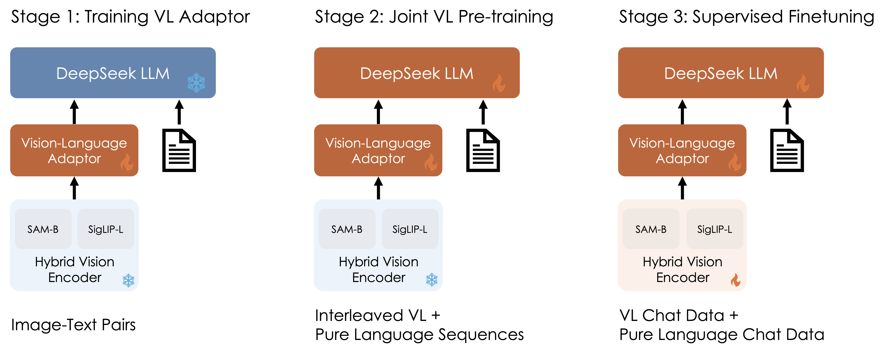

# DeepSeek VL2 Cog model

This is a Cog model for the DeepSeek VL2 language model.

## Usage

    cog predict -i image=<image> prompt=<prompt>

## Input

    cog predict -i image=@demo.png prompt="Describe each stage of this <image> in detail"

# Output

    The diagram illustrates a three-stage process for training and fine-tuning a model using a combination of vision-language (VL) adaptation, pre-training, and supervised finetuning. Here's a detailed breakdown of each stage:

    ### Stage 1: Training VL Adaptor
    - **Components Involved:**
    - **DeepSeek LLM:** This is the large language model that will be adapted to work with visual data.
    - **Vision-Language Adaptor:** A module designed to bridge the gap between visual inputs and the language model.
    - **Hybrid Vision Encoder:** This encoder processes visual information from images and text pairs. It consists of two components:
        - **SAM-B:** Likely a component related to spatial attention mechanisms.
        - **SigLIP-L:** Possibly a component related to signal processing or lip reading.

    - **Process:**
    - The hybrid vision encoder takes image-text pairs as input.
    - The vision-language adaptor then uses these processed visual features to interact with the DeepSeek LLM.

    ### Stage 2: Joint VL Pre-training
    - **Components Involved:**
    - Same as Stage 1, but now the system is being trained on interleaved VL + pure language sequences.

    - **Process:**
    - The hybrid vision encoder continues to process visual information.
    - The vision-language adaptor integrates these visual features with the DeepSeek LLM.
    - The model is pre-trained on a dataset that includes both visual-linguistic and purely linguistic sequences.

    ### Stage 3: Supervised Finetuning
    - **Components Involved:**
    - Same as Stage 1 and Stage 2, but now the system is being fine-tuned on VL chat data + pure language chat data.

    - **Process:**
    - The hybrid vision encoder processes the new dataset.
    - The vision-language adaptor combines the visual features with the DeepSeek LLM.
    - The model undergoes supervised finetuning to improve its performance on specific tasks, such as understanding and generating responses in VL chat contexts.

    ### Summary
    The overall process involves:
    1. **Training the VL Adaptor:** Using image-text pairs to train the vision-language adaptor and hybrid vision encoder.
    2. **Joint Pre-training:** Integrating visual and linguistic information to pre-train the model on a mixed dataset.
    3. **Supervised Finetuning:** Fine-tuning the model on specialized VL chat data to enhance its capabilities in handling conversational tasks.